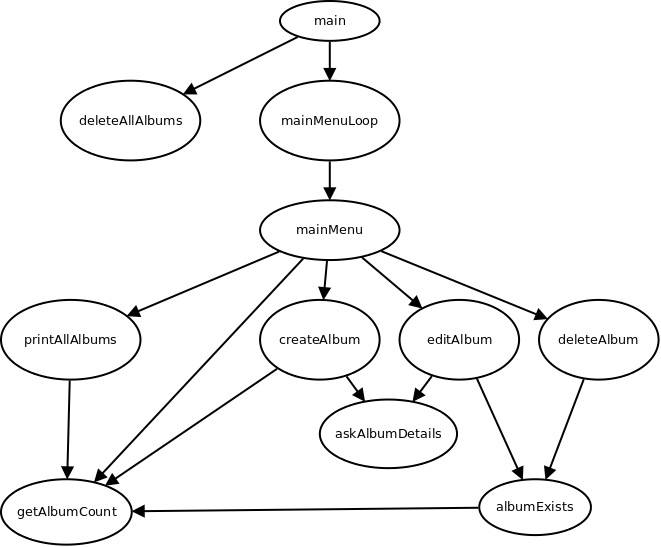

# CPSC 120-10 - Lab 14 - Instructions

This week we're going to start learning how to work with arrays.

## Part 1 - Program Setup

Setup your program with the following details:

* Your program's Makefile target should be named *lab14*, and execute by default

* Your program's executable name should be: *lab14.bin*

* Your program's source file should be: *main.cpp*

## Part 2 - Revisiting Our Simple Music Store

You may recall an earlier lab where we hard-coded the names and prices of albums using enumerations. This week, we'll learn how to write a store that can handle a dynamic number of albums, as well as change their values when needed.

### Maximum Albums

Before we can manage arrays, we'll need to declare a constant value representing the maximum size of our store. For now, management is confident we won't need our store to remember more than 100 albums. We can always change this value later, if our store is successful.

Because C++ demands we know a fixed maximum size of any arrays we intend to pass into functions, you'll need to declare a global constant variable, of type ```size_t```, equal to the number 100.

Name this constant ```MAX_ALBUMS``` and make sure it appears before any function prototypes or definitions, so the compiler knows about it before attempting to compile the rest of your program.

### Parallel Arrays

We'll practice the concept of *parallel arrays* this week, since we're not learning *C++ Classes* yet. Parallel arrays aren't quite as powerful when it comes to storing many properties of an abstract object, but they'll do for now.

#### Data We'll Be storing

You'll need a parallel array for each of the following album properties:

|Property|Array Variable Name|Data Type|Description                          |
|---     |---                |---      |---                                  |
|Title   |album_titles       |string   |The title of each album              |
|Price   |album_prices       |int      |The price of each album, in cents    |
|Quantity|album_quantities   |int      |The number of albums we have in stock|

Declare these arrays as local variables of your ```main``` function, not as global variables. This will give us some practice passing array references through functions.

There is another property: The albums number. This is just the index an album appears at, in the parallel arrays. For example, *Album #3* has its data in the following places:

* Its title is at album_titles[3]
* Its price is at album_prices[3]
* Its quantity is at album_quantities[3]

*Hint*: Yes, this means you'd end up with an *Album #0* at the beginning of your array.

#### Sentinel Values

You may be wondering how we keep track of *how many* valid album entries we have, when all our arrays use a fixed size. We'll keep track of this using *sentinel values* again.

Create a constant global variable named ```ALBUM_TITLE_SENTINEL``` of type ```std::string```, and assign to it the string ```[___END_OF_ALBUMS___]```

### Album Count

The first useful function you should make is something to tell you how many albums are currently in your store. Here's a prototype to help get you started:

```cpp

size_t getAlbumCount(std::string(&titles)[MAX_ALBUMS]);

```

This function will return an ```int``` representing the number of albums in your store. This can be easily determined with a loop that iterates from 0 to the maximum allowed album number (```MAX_ALBUMS - 1```), calling on ```break``` to exit the loop when the sentinel value is encountered.

As you can see, we'll pass the parallel array for the album titles *by reference* into the ```getAlbumCount``` function, so it can work with the original data.

Just as a reminder, your ```main``` function could call such a function like so:

```cpp

size_t count = getAlbumCount(album_titles);

```

Also, here's a generalized hint for how you might get some function to accept all the parallel arrays at the same time:

```cpp

void someFunction(std::string(&titles)[MAX_ALBUMS], int(&prices)[MAX_ALBUMS], int(&quantities)[MAX_ALBUMS]);

```

### Album Exists?

Relying on the useful function ```getAlbumCount```, we can now write a function that determines whether or not an album number is valid. This can be a useful check before we edit or delete (what we believe to be) an existing album.

Create a new function with the following prototype:

```cpp

bool albumExists(int album_number, std::string(&titles)[MAX_ALBUMS]);

```

Your initial instinct may be to loop from 0 and the maximum allowed album number, looking for the sentinel. This would work but would be inefficient because we already have ```getAlbumCount``` to rely on.

Simply test to see if the ```album_number``` argument is *greater than or equal to* 0, and also *less than* the total number of albums. For example, if we have 5 albums, then the maximum allowed index is album #4. If we have 16 albums, the maximum allowed index is album #15. And so forth.

You can now use this function to quickly and easily determine if any particular album number exists, before editing or deleting! Remember: A function that returns ```bool``` can be assigned to boolean variables or even used as an expression inside an ```if``` statement.


### Delete All Albums

Create a new function named ```deleteAllAlbums```. This function returns nothing (```void```) and has one job: Deleting all albums.

How do we "delete" all albums? It's simple! Just write the sentinel value to index 0. Other parts of your program will see the sentinel and assume your store has no data.

Your main function should call this function right after all parallel arrays are initialized, so your store always starts out empty.

### Asking for Album Details

We're going to ask the user to input album details, in two different areas of our program:

1. When creating an album

2. When editing an album

How can we use modular programming to prevent some repeated code? Let's make a new function with the following prototype:

```cpp

bool askAlbumDetails(std::string prompt, std::string& title, int& price, int& quantity);

```

This function should start by printing the ```prompt``` string on its own line. This allows any caller of this function to provide a custom message before asking the user for input.

We'll then have this function input the three main pieces of data:

1. Ask the user *Please enter the album's title, or none to abort. Do not use spaces!* and store it into the appropriate argument. Remember: We can return data to the caller using by-reference arguments.

    * Just after the title is input, the function should validate the album's title. If the album's title was the word *none*, print the message *Album title was none!* and return ```false``` to indicate that the user's input was invalid or unsuccessful.

    * You don't need to validate for lack of spaces; This constraint just lets you use cin instead of grabbing a whole line. You may choose to support spaces if you wish.

2. Next, ask the user *Please enter the album's price:* and store it into the appropriate argument.

    * Just after the price is input, the function should validate the album's price. If the price is less than 1 cent, print the message *Album price was invalid!* and return ```false``` to indicate that the user's input was invalid or unsuccessful.

3. Next, ask the user *Please enter the quantity of this album that we have in stock:*, and store it into the appropriate argument.

    * We don't need to check the album's quantity, as your manager may decide the store has a negative quantity of some item, for some reason.

Finally, if the function hasn't returned ```false``` yet, have it return ```true``` to indicate that the user's input was valid or successful.

From now on, other places in your program can rely on this function to ask the user for some input, and validate it, all in one easy function call!

### Main Menu

We're ready to show the user our main menu. As we did in a previous lab, this menu should be implemented by two functions:

* A function called ```mainMenuLoop```
* A function called ```mainMenu```

The logic for these functions is the same as the previous lab; ```mainMenuLoop``` repeatedly calls ```mainMenu``` until a ```false``` return value is received; The ```mainMenu``` function prints the menu and responds accordingly to the user's input. The menu should look like the following:

```text

*** Music Store Manager Interface - Main Menu ***

There are currently ALBUM_COUNT albums in the store.

1. View all albums
2. Create a new album
3. Edit an existing album
4. Delete an album
Q. Quit this program

Enter your choice: 

```

Naturally, the string *ALBUM_COUNT* above would be replaced with the actual count of albums your store currently has, which can be obtained with the ```getAlbumCount``` function you wrote earlier.

At this point where you may be wondering: *How do I call on getAlbumCount if I don't have the album_titles array available here?* The answer is to have ```main``` give ```mainMenuLoop``` the array, which in turn gives ```mainMenu``` the array, which in turn gives ```getAlbumCount``` the array! Array-ception! *Hint*: Actually, you probably want to give the main menu all the arrays, not just the titles.

As usual, the individual menu options will be explained further below.

### View All Albums

When the user selects to view all albums, your program should simply print out all albums one by one. Create a new function named ```printAllAlbums``` that accomplishes this task.

Each album should be printed on a line by itself. For each album/line, print the following columns:

* The album's number (the index where it appears in the arrays)
* The album's title
* The album's price (in cents)
* The quantity of this album we have available in stock

The album's title column should be printed with a fixed width of 30 characters. All other columns should be printed with a fixed width of 5 characters. You should use global constants to avoid hard-coding these widths. All columns should be left-aligned.

Here's an example of the expected formatting (don't worry about the actual values for now):

```text
0    Dare to Be Stupid             999  10   
1    Polka Party                   899  8    
2    Bad Hair Day                  699  7    
3    Running With Scissors         999  3    
```

### Create a new album

When the user selects to create a new album, your program should call a new function named ```createAlbum```. This function should rely on the ```askAlbumDetails``` function you created earlier to get album details from the user. When calling ```askAlbumDetails```, use the following string for the value of the ```prompt``` argument: *Creating a New Album*.

If the ```askAlbumDetails``` returns ```false```, we should know the user didn't enter the details correctly and cannot create a new album now. Print the message *Aborting album creation!* and return to the caller.

Your program should use the current album count to detect if our store is already full (i.e., we're already storing the maximum number of albums). If our store is already full, complain to the user: *Sorry, the store is full!* and return to the main menu.

However, if the details were valid, add that information as a new album to the end of the parallel arrays.

How do we "add" to the end of the parallel arrays, exactly? The process is quite simple:

1. Determine the current count of albums in our store.

    * You can rely on ```getAlbumCount``` for this.

2. Use that count to determine the *last valid index* of our data arrays.

3. Write our new data to the *next index* in our data arrays.

4. Write our sentinel value to the index after our new data.

So for example, suppose we had 4 albums in our store. This would mean the last valid index in our parallel arrays was 3 (because the indexes go: 0, 1, 2, 3), and our sentinel value was at index 4. We would then write our new album into index 4, and rewrite our sentinel value to index 5.

After creating the new album, announce to the user *Album created successfully*, and return back to the main menu.

### Edit an Existing Album

If the user selects to edit an existing album, call a new function named ```editAlbum```, which should do the following:

1. Ask the user: *Enter the album number to edit*, and store the album number in a variable.

2. Validate the album number.

    * Rely on ```albumExists``` to check whether the album exists in the store.

    * If the album isn't in the store, complain *Invalid Album!*, and return back to the caller.

3. Rely on ```askAlbumDetails``` to ask the user for the new title, price, and quantity of the album we're editing.

    * When calling ```askAlbumDetails```, use the following string for the value of the ```prompt``` argument: *Editing an Album*.

    * If ```askAlbumDetails``` returns ```false```, print the message *Aborting edit!* and return to the caller.

4. Apply the new title, price, and quantity to the appropriate arrays.

5. Print *Edit Successful!*, and return back to the main menu.

Return back to the caller.

### Delete an Album

If the user selects to delete an existing album, call a new function named ```deleteAlbum``` which does the following:

1. Asks the user *Enter the album number to delete*, and stores the album number in a variable

2. Validates the album number, just like the *edit* functionality does

3. Deletes the album

4. Prints *Delete Successful!*, and returns back to the caller

So how do you "delete" an album? Essentially you point and say "That index is delet!", scootch all further albums left by one index to fill the hole.

For example, suppose I have 5 albums at indexes 0, 1, 2, 3, 4. You could also say "I have an Album #0, an Album #1, #2, #3, and #4", since we're using indexes as synonyms for album numbers.

In order to delete the album at index 2, I would simply do the following:

1. Point and say "Album 2 is delet!"

    * (it helps if you say this loudly, with other people around)

2. Write Album #3's data to the #2 slot

3. Write Album #4's data to the #3 slot

4. Write Album #5's data to the #4 slot

What's that you say? There was no Album #5? This is just a trick to simplify your code while still making sure the sentinel ends up in the right spot. If you prefer, you can skip this step, and simply write the sentinel manually.

You don't even need to stop your loop once you reach the sentinel. You can just loop over the entire length of the arrays. But *Hint*: Be very careful about out-of-bounds indexing here.

### Quit the Program

As usual, if the user chooses to quit the program by typing ```Q``` (remember that this should be interpreted in a case-insensitive way), your ```mainMenu``` function should print *Okay, quitting!* and return ```false```, to let the ```mainMenuLoop``` program know to stop looping.

### Invalid Input

If the user enters invalid input, simply print *Invalid input!* and continue showing the main menu.

## Part 3 - Load/Save the Database, Not

You may be thinking it would be a great idea to add save/delete functionality to this program, so your database persists across reboots. I highly suggest adding this upgrade to your program in your spare time after the semester is over, but you don't need to implement this part for your grade.

***Repeat***: ***You do not have to implement this part!*** It will not be graded. In fact, please don't implement this until *after* this assignment is graded, because it may throw off my automated grading program.

But just as a suggestion for your future adventures, try the following:

### Saving the Database

First, make a new function called ```saveData``` that gets called whenever the program modifies its database (i.e., create, edit, or delete). Each of the parallel arrays can be written to an individual file, with each index taking up a line. Here's an idea:

|Array           |File Name     |
|---             |---           |
|album_titles    |titles.txt    |
|album_prices    |prices.txt    |
|album_quantities|quantities.txt|

Just like the actual parallel arrays, each of these files would have identical sizes, with each "line number" corresponding to the same album.

For example, the first line in each file would correspond to album #0, and the fourth line in each file would correspond to album #3.

You don't even need to worry about parsing the sentinel, or limiting the length. Just write the entire length of the array as-is.

Reminder: You can use the function [to_string](https://www.cplusplus.com/reference/string/to_string/) to convert a numeric value to an ```std::string```.

### Loading the Database

Next, make a new function called ```loadData``` which essentially does the opposite as ```saveData```. Make sure it gets called once, at the very beginning of your program.

This function should essentially open each file, read each line, and write those values to your parallel arrays.

Reminder: You can use the function [atof](https://www.cplusplus.com/reference/cstdlib/atof/) to convert a string to a double.

## Part 4 - Sample Output and Call Graph

This section is intended to help provide clarification of the above assignment.

### Call Graph

You may find the following call graph helpful:



*Disclaimer*: This diagram was done quickly and may not be 100% correct. But it's purpose is more to nudge you in the right direction; To help you start wrapping your mind around how the functions in the program would call each other, and why they are organized this way.

### Sample Output

As usual, here's some sample output from a winning implementation of this program, to help clarify how the program behaves:

```text

Building lab14.bin
g++ -Wall -pedantic -std=c++17 -g  main.cpp -o lab14.bin
Executing lab14
./lab14.bin

*** Music Store Manager Interface - Main Menu ***

There are currently 0 albums in the store.

1. View all albums
2. Create a new album
3. Edit an existing album
4. Delete an album
Q. Quit this program

Enter your choice: 1

*** Music Store Manager Interface - Main Menu ***

There are currently 0 albums in the store.

1. View all albums
2. Create a new album
3. Edit an existing album
4. Delete an album
Q. Quit this program

Enter your choice: 3
Enter the album number to edit: 0
Invalid album!

*** Music Store Manager Interface - Main Menu ***

There are currently 0 albums in the store.

1. View all albums
2. Create a new album
3. Edit an existing album
4. Delete an album
Q. Quit this program

Enter your choice: 4
Enter the album number to delete: 0
Invalid album!

*** Music Store Manager Interface - Main Menu ***

There are currently 0 albums in the store.

1. View all albums
2. Create a new album
3. Edit an existing album
4. Delete an album
Q. Quit this program

Enter your choice: 2
Creating a New Album
Please enter the album's title, or none to abort. Do not use spaces!
==> one
Please enter the album's price: 2
Please enter the quantity of this album that we have in stock: 3
Album created successfully

*** Music Store Manager Interface - Main Menu ***

There are currently 1 albums in the store.

1. View all albums
2. Create a new album
3. Edit an existing album
4. Delete an album
Q. Quit this program

Enter your choice: 2
Creating a New Album
Please enter the album's title, or none to abort. Do not use spaces!
==> two
Please enter the album's price: 3
Please enter the quantity of this album that we have in stock: 4
Album created successfully

*** Music Store Manager Interface - Main Menu ***

There are currently 2 albums in the store.

1. View all albums
2. Create a new album
3. Edit an existing album
4. Delete an album
Q. Quit this program

Enter your choice: 2
Creating a New Album
Please enter the album's title, or none to abort. Do not use spaces!
==> three
Please enter the album's price: 4
Please enter the quantity of this album that we have in stock: 5
Album created successfully

*** Music Store Manager Interface - Main Menu ***

There are currently 3 albums in the store.

1. View all albums
2. Create a new album
3. Edit an existing album
4. Delete an album
Q. Quit this program

Enter your choice: 1
0    one                           2    3    
1    two                           3    4    
2    three                         4    5    

*** Music Store Manager Interface - Main Menu ***

There are currently 3 albums in the store.

1. View all albums
2. Create a new album
3. Edit an existing album
4. Delete an album
Q. Quit this program

Enter your choice: 3
Enter the album number to edit: 6
Invalid album!

*** Music Store Manager Interface - Main Menu ***

There are currently 3 albums in the store.

1. View all albums
2. Create a new album
3. Edit an existing album
4. Delete an album
Q. Quit this program

Enter your choice: 3
Enter the album number to edit: 1
Editing an Album
Please enter the album's title, or none to abort. Do not use spaces!
==> TWO_EDITED
Please enter the album's price: 999
Please enter the quantity of this album that we have in stock: 10
Edit Successful!

*** Music Store Manager Interface - Main Menu ***

There are currently 3 albums in the store.

1. View all albums
2. Create a new album
3. Edit an existing album
4. Delete an album
Q. Quit this program

Enter your choice: 1
0    one                           2    3    
1    TWO_EDITED                    999  10   
2    three                         4    5    

*** Music Store Manager Interface - Main Menu ***

There are currently 3 albums in the store.

1. View all albums
2. Create a new album
3. Edit an existing album
4. Delete an album
Q. Quit this program

Enter your choice: 4
Enter the album number to delete: 9
Invalid album!

*** Music Store Manager Interface - Main Menu ***

There are currently 3 albums in the store.

1. View all albums
2. Create a new album
3. Edit an existing album
4. Delete an album
Q. Quit this program

Enter your choice: 4
Enter the album number to delete: 1
Delete Successful!

*** Music Store Manager Interface - Main Menu ***

There are currently 2 albums in the store.

1. View all albums
2. Create a new album
3. Edit an existing album
4. Delete an album
Q. Quit this program

Enter your choice: 1
0    one                           2    3    
1    three                         4    5    

*** Music Store Manager Interface - Main Menu ***

There are currently 2 albums in the store.

1. View all albums
2. Create a new album
3. Edit an existing album
4. Delete an album
Q. Quit this program

Enter your choice: weuiywefy
Invalid choice!

*** Music Store Manager Interface - Main Menu ***

There are currently 2 albums in the store.

1. View all albums
2. Create a new album
3. Edit an existing album
4. Delete an album
Q. Quit this program

Enter your choice: q
Okay, quitting!
Program ending

```


